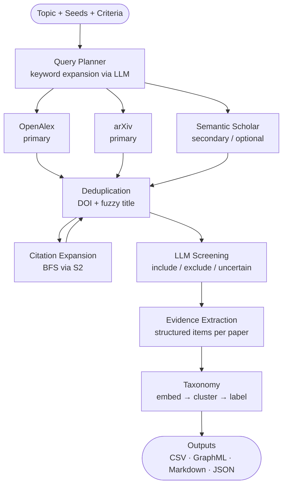

# ReviewTrace

**Auditable, traceable academic literature review — powered by LLMs, grounded in provenance.**

ReviewTrace is open-source research infrastructure that turns a topic string into a reproducible literature review: it retrieves papers from multiple sources, expands the citation graph, screens with an LLM, extracts structured evidence, and builds a taxonomy — all with a full audit trail so every claim can be traced back to its source.

> Instead of asking "Can AI write my related work?",  
> ReviewTrace asks: **"Can every claim in this review be traced, checked, and audited?"**

---

## Why ReviewTrace

Most LLM-assisted literature tools are black boxes. They hallucinate citations, collapse nuance, and produce output you cannot verify. ReviewTrace is designed around the opposite principle: every paper in the corpus has a retrieval provenance record, every screening decision has a recorded rationale, and every taxonomy node links back to specific evidence items from specific papers.

If you are writing a systematic review, a related-work section, or an evidence synthesis and you need to be able to answer **"where did this come from?"** for any claim in your output, ReviewTrace is built for you.

---

## What it does

1. **Retrieval** — keyword search across OpenAlex (primary) and arXiv (primary), plus optional Semantic Scholar citation metadata
2. **Seed loading** — inject known papers by arXiv ID or DOI; they anchor the citation graph
3. **Deduplication** — DOI/arXiv-level exact dedup at DB insert time + fuzzy title matching (Levenshtein ≥ 0.9) as a post-pass
4. **Citation expansion** — BFS traversal of forward and backward citations via Semantic Scholar, configurable depth and breadth
5. **LLM screening** — include/exclude/uncertain decisions for every paper, with configurable per-source-type policies
6. **Evidence extraction** — structured evidence items (method, finding, claim, dataset, limitation) extracted from included paper abstracts
7. **Taxonomy** — embedding-based clustering → LLM-labelled taxonomy nodes → evidence items linked to nodes
8. **Export** — `papers.csv`, `citation_graph.graphml`, `evidence_matrix.csv`, `evidence_items.json`, `taxonomy.md`, audit JSON + Markdown

---

## Pipeline overview



---

## Features

| Feature | Details |
|---|---|
| Multi-source retrieval | OpenAlex + arXiv primary; S2 secondary (citation metadata + optional search) |
| LLM keyword expansion | 8 related search terms generated from topic + seed abstracts |
| Citation graph BFS | Configurable depth (default 2) and breadth (default 30 papers/hop) |
| Deduplication | Exact (DOI/arXiv) + fuzzy title (threshold 0.9) |
| Screening | LLM include/exclude/uncertain with per-source-type policy gate |
| Evidence extraction | 5 evidence types: method, finding, claim, dataset, limitation |
| Taxonomy | Embedding clusters → LLM-labelled nodes → evidence links |
| Full audit trail | Append-only SQLite provenance: retrieval runs, paper found events, screening decisions |
| Export formats | CSV, GraphML, Markdown, JSON |
| Web UI | FastAPI + React, real-time SSE progress stream |
| Demo mode | 3 queries, 10 results/query, no citation expansion — safe first run |
| arXiv rate limiting | 429 retry with 10s / 30s backoff, graceful skip after 3rd failure |

---

## Quickstart

### 1. Install

```bash
conda create -n reviewtrace python=3.11 -y
conda activate reviewtrace
pip install -e ".[all-llm]"
```

Install frontend dependencies (only needed once for the Web UI):

```bash
cd web && npm install && cd ..
```

### 2. Configure

Copy `.env.example` to `.env` and fill in at least one LLM provider key:

```env
# At least one of:
OPENAI_API_KEY=sk-...
ANTHROPIC_API_KEY=sk-ant-...
GEMINI_API_KEY=...

# Optional — enables higher-rate S2 citation metadata
SEMANTIC_SCHOLAR_API_KEY=...
```

### 3. Run (one-command demo)

```bash
reviewtrace demo
```

Runs the sparse autoencoders example with demo settings (3 queries, 15 results/query, no citation expansion). Outputs are written to `outputs/sparse_autoencoders_demo/`. No S2 API key required.

### 4. Run (Web UI)

```bash
reviewtrace web
```

The browser opens automatically at `http://127.0.0.1:8000`. Demo mode is on by default — safe to try without an S2 key.

### 5. Run (CLI — custom topic with demo settings)

```bash
reviewtrace run \
  --topic "sparse autoencoders for mechanistic interpretability" \
  --seeds examples/sparse_autoencoders/seeds.txt \
  --criteria examples/sparse_autoencoders/criteria.json \
  --output-dir outputs/sparse_autoencoders_demo/ \
  --demo
```

### 6. Run (CLI — full)

```bash
reviewtrace run \
  --topic "sparse autoencoders for mechanistic interpretability" \
  --seeds examples/sparse_autoencoders/seeds.txt \
  --criteria examples/sparse_autoencoders/criteria.json \
  --max-results 50 \
  --depth 2
```

---

## Configuration

All settings can be set via environment variables or `.env`:

| Variable | Default | Description |
|---|---|---|
| `OPENAI_API_KEY` | — | OpenAI API key (GPT-4o etc.) |
| `ANTHROPIC_API_KEY` | — | Anthropic API key (Claude) |
| `GEMINI_API_KEY` | — | Google Gemini API key |
| `SEMANTIC_SCHOLAR_API_KEY` | — | S2 key (higher rate limits) |
| `LLM_PROVIDER` | auto-detect | `openai`, `anthropic`, or `gemini` |
| `LLM_MODEL` | provider default | Override model name |
| `REVIEWTRACE_DB_PATH` | `reviewtrace.db` | SQLite database path |
| `REVIEWTRACE_OUTPUT_DIR` | `outputs/` | Output directory |

---

## Outputs

| File | Contents |
|---|---|
| `papers.csv` | All papers: title, authors, year, venue, DOI, arXiv ID, screening decision |
| `retrieval_audit.json` | All retrieval runs with timestamps, query, source, result counts |
| `retrieval_audit.md` | Human-readable version of the retrieval audit |
| `citation_graph.graphml` | Paper nodes + citation edges for use in Gephi / NetworkX |
| `evidence_matrix.csv` | Evidence items × papers matrix |
| `evidence_items.json` | Structured evidence items with type, content, relevance score |
| `taxonomy.md` | Taxonomy nodes with labels, descriptions, linked papers and evidence |

---

## Web UI

```bash
reviewtrace web                  # build frontend + start server + open browser
reviewtrace web --skip-build     # reuse existing build (faster on subsequent runs)
reviewtrace web --port 8080      # custom port
```

The Web UI has five pages:

- **Run** — configure and launch the pipeline with live SSE progress stream
- **Papers** — browse and filter the paper corpus; view screening decisions
- **Taxonomy** — explore taxonomy nodes and linked evidence
- **Audit** — inspect retrieval runs and paper provenance records
- **Export** — download output files

**Demo mode** (default enabled in the UI) limits the pipeline to 3 queries and 10 results per query, and skips citation expansion. This is safe for a first run without an S2 API key.

---

## CLI Reference

```
reviewtrace demo      One-command sparse autoencoders demo (fast, no expansion)
reviewtrace run       Full pipeline end-to-end
reviewtrace retrieve  Keyword retrieval only
reviewtrace expand    Citation graph expansion only
reviewtrace screen    LLM screening only
reviewtrace dedup     Deduplication pass
reviewtrace extract   Evidence extraction only
reviewtrace taxonomize  Taxonomy build only
reviewtrace export    Export all outputs
reviewtrace web       Web UI (build + serve + open browser)
reviewtrace serve     API server only (no build, for dev)
```

Key flags for `reviewtrace run`:

```
--topic / -t          Research topic (required)
--seeds / -s          Seeds file (one arXiv ID or DOI per line)
--criteria / -c       Screening criteria JSON file
--max-results / -n    Max results per query (default: 50)
--depth               Citation expansion depth (default: 2)
--skip-expand         Skip citation graph expansion
--demo                Demo mode (max 3 queries, max_results=10, depth=0, no S2)
--max-queries         Override number of search queries
--db                  SQLite database path (default: reviewtrace.db)
--output-dir / -o     Output directory (default: outputs/)
```

---

## Seeds and criteria formats

**Seeds file** (`seeds.txt`) — one identifier per line:

```
2309.05144
arXiv:2401.12631
10.1162/neco_a_01351
```

**Criteria file** (`criteria.json`):

```json
{
  "topic": "sparse autoencoders for mechanistic interpretability",
  "inclusion": [
    "Proposes or evaluates sparse autoencoders (SAEs) for feature extraction in neural networks",
    "Applies dictionary learning or sparse coding to neural network activations"
  ],
  "exclusion": [
    "Does not involve neural network interpretability or mechanistic analysis",
    "Purely theoretical without empirical validation"
  ]
}
```

See `examples/sparse_autoencoders/` for a complete working example.

---

## Architecture

```
reviewtrace/
  retrieval/        Query planner, orchestrator, API clients (OpenAlex, arXiv, S2)
  expansion/        Citation graph BFS controller
  screening/        LLM screener, source-type policy
  evidence/         Evidence extractor, evidence matrix
  taxonomy/         Embedder, clusterer, labeller, taxonomy exporter
  audit/            Dedup, export, audit logger
  db/               SQLite connection, schema (10 tables), migrations
  api/              FastAPI app, routes, SSE streaming, Pydantic schemas
  llm.py            Unified LLM completion interface (OpenAI / Anthropic / Gemini)
  cli.py            Typer CLI entry point
web/
  src/pages/        RunPage, PapersPage, TaxonomyPage, AuditPage, ExportPage
```

For more detail see [`docs/ARCHITECTURE.md`](docs/ARCHITECTURE.md) and [`docs/AUDIT_MODEL.md`](docs/AUDIT_MODEL.md).

---

## Audit model

Every paper in the corpus has a retrieval provenance record that stores:

- Which query and source it came from
- The run timestamp and run ID
- Whether it was inserted as a seed, discovered via keyword search, or found via citation expansion
- The citation path (for expanded papers)

Screening decisions record the LLM rationale and confidence score. Evidence items link back to specific papers. Taxonomy nodes link to specific evidence items.

This means you can reconstruct the full derivation chain for any claim: taxonomy node → evidence item → paper → retrieval run → query.

See [`docs/AUDIT_MODEL.md`](docs/AUDIT_MODEL.md) for the complete provenance specification.

---

## Current limitations

- **No full-text retrieval** — abstracts only; evidence extraction quality is limited by what is disclosed in the abstract
- **No persistent paper storage** — PDFs are not downloaded; the pipeline is metadata-only
- **S2 rate limits** — without an API key, Semantic Scholar calls are rate-limited to ~1 req/s; citation expansion on large corpora will be slow
- **LLM cost** — screening and evidence extraction make one LLM call per paper; large runs (500+ papers) can be expensive
- **Single-machine** — no distributed job queue; very large runs (>1000 papers) should use the CLI rather than the Web UI
- **English-only LLM prompts** — screening and taxonomy labelling are prompted in English; non-English abstracts are processed but prompt language is fixed

---

## Roadmap

- [ ] Full-text retrieval via Unpaywall / Semantic Reader
- [ ] PRISMA-style flowchart export
- [ ] Incremental runs (add new papers to existing review)
- [ ] Multi-review comparison
- [ ] Export to Zotero / BibTeX
- [ ] Evaluation harness (precision/recall against gold-standard corpora)

---

## Development

```bash
# Run linter
ruff check reviewtrace

# Type-check
mypy reviewtrace

# Run tests
pytest tests/ -v
```

See [`CONTRIBUTING.md`](CONTRIBUTING.md) for setup and contribution guidelines.

---

## Citation

If you use ReviewTrace in academic work, please cite:

```bibtex
@software{peng2026reviewtrace,
  author  = {Peng, Yicheng},
  title   = {{ReviewTrace}: Auditable Literature Review Infrastructure},
  year    = {2026},
  url     = {https://github.com/Erber102/ReviewTrace},
  license = {MIT}
}
```

---

## License

MIT © 2026 Yicheng Peng — see [LICENSE](LICENSE).
