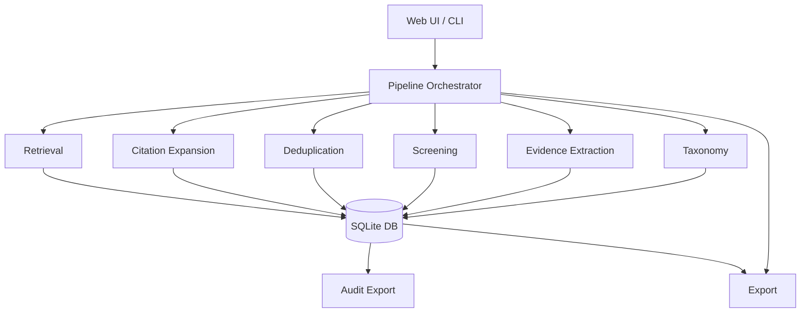

# Architecture

## Overview



## Data flow

1. **User provides** topic, optional seed papers, optional screening criteria.
2. **Retrieval modules** query OpenAlex and arXiv (primary sources). Semantic Scholar is queried optionally when an API key is configured.
3. **Optional citation expansion** discovers related papers by following citation and reference links from seed papers, using BFS up to a configurable depth.
4. **Deduplication** merges papers with matching DOIs (enforced at the database layer) or near-identical titles (Levenshtein ratio ≥ 0.9).
5. **Screening** applies source-type policy checks (peer_reviewed, preprint, workshop, blog) followed by LLM-assisted include/exclude/uncertain decisions.
6. **Evidence extraction** identifies structured evidence items in included papers: method proposals, empirical findings, theoretical claims, limitations, comparisons, and dataset contributions.
7. **Taxonomy construction** embeds evidence items, clusters them with KMeans, labels clusters via LLM, and links evidence to taxonomy nodes using embedding similarity + LLM confirmation.
8. **Export modules** generate papers.csv, retrieval_audit.json/.md, citation_graph.graphml, evidence_items.json, evidence_matrix.csv, and taxonomy.md.

## Storage

All data is stored in a local SQLite database (`reviewtrace.db` by default). The schema uses 10 tables:

| Table | Purpose |
|---|---|
| `papers` | Paper metadata with deterministic ID |
| `retrieval_runs` | One record per retrieval query execution |
| `paper_retrievals` | Links papers to retrieval runs (audit trail) |
| `dedup_decisions` | Records of deduplication merges |
| `screening_decisions` | Include/exclude/uncertain decisions per paper |
| `evidence_items` | Extracted evidence linked to papers |
| `taxonomy_nodes` | Generated thematic clusters |
| `taxonomy_evidence` | Links evidence items to taxonomy nodes |
| `generated_claims` | (Reserved for claim verification) |
| `claim_verifications` | (Reserved for claim verification) |

## Module layout

```
reviewtrace/
├── config/          # Settings, .env loading
├── db/              # Schema, migrations, connection helpers (raw SQL, no ORM)
├── llm.py           # Unified LLM interface (Anthropic / OpenAI / Google / DeepSeek)
├── retrieval/       # Keyword search clients + orchestrator + query planner + seed loader
│   └── clients/     # OpenAlex, arXiv, Semantic Scholar clients
├── audit/           # Provenance logger, deduplication, audit export
├── expansion/       # BFS citation expansion (forward + backward)
├── screening/       # Source classifier, policy gate, LLM screener
├── evidence/        # Evidence extractor + matrix export
├── taxonomy/        # Embedder, KMeans clusterer, LLM labeler, linker, exporter
├── export/          # papers.csv + citation_graph.graphml
└── api/             # FastAPI backend (Web UI server)
    └── routes/      # Pipeline, papers, audit, export routes
```

## Paper identity

Each paper receives a deterministic 16-character ID derived from its primary identifier:

- `sha256("doi:<DOI>")[:16]` — for papers with a DOI
- `sha256("arxiv:<ID>")[:16]` — for arXiv preprints without a DOI
- `sha256("title:<title>")[:16]` — fallback for papers without either

This ensures the same paper retrieved from multiple sources always maps to the same database row.

## Audit trail idempotency

Every paper-run association is recorded with a deterministic ID: `sha256("<paper_id>:<run_id>")[:16]`. INSERT OR IGNORE ensures re-running the same query does not create duplicate audit records.
